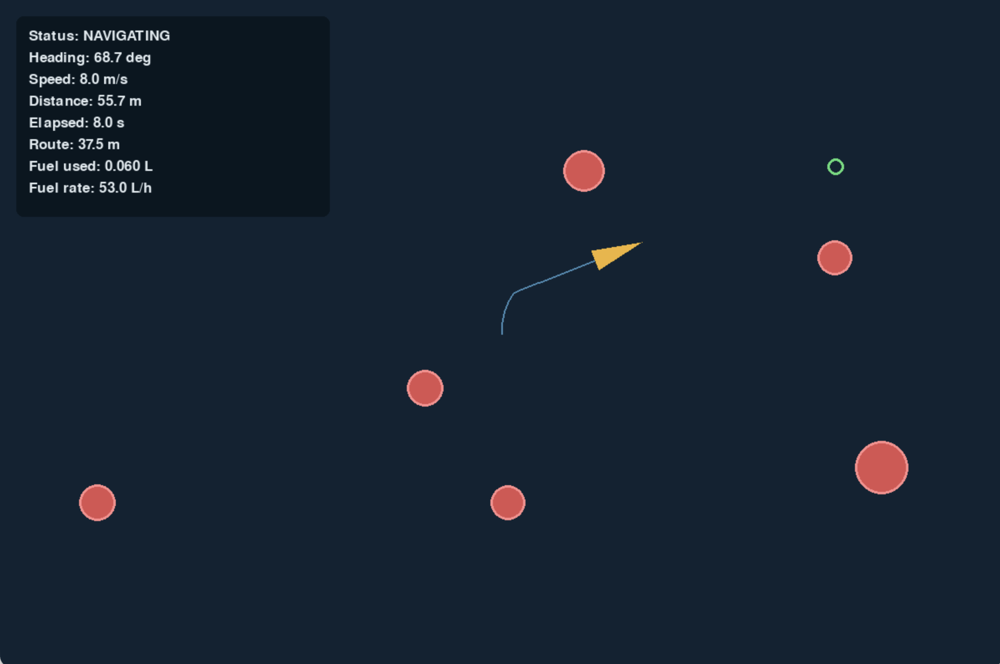
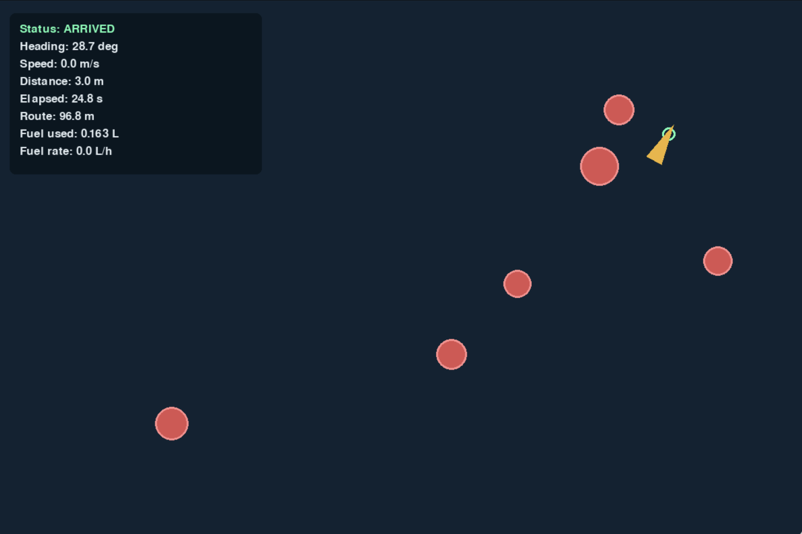

# Autonomous Surface Vessel Navigation Simulator

A Python engineering simulation of an autonomous surface vessel navigating through a two-dimensional environment with static obstacles.

The project demonstrates autonomous waypoint navigation, reactive collision avoidance, simplified vessel maneuvering, safe navigation failure, interactive mission control, and mission-performance tracking. It was developed incrementally as a portfolio project focused on maritime autonomy, simulation, and test-driven engineering.

<p align="center">
  
  
</p>

## Current Version: 1.0

Version 1.0 includes:

* Continuous vessel motion in real-world units
* Maritime heading convention, measured clockwise from north
* Frame-rate-independent simulation updates
* Mouse-selected destination navigation
* Destination-safety validation before mission acceptance
* Shortest-direction heading control
* Configurable maximum turn-rate limiting
* Gradual acceleration and deceleration
* Reduced guidance speed during demanding turns and obstacle approaches
* Automatic return to normal operating speed when conditions permit
* Arrival detection and automatic stopping
* Multiple static circular obstacles
* Triangular vessel hull matching the displayed vessel geometry
* Vessel-hull-to-obstacle collision detection
* Automatic stopping after collision
* Direct-route obstacle detection
* Nearest-blocking-obstacle selection
* Preferred-side and opposite-side avoidance candidates
* Candidate safety checks against all obstacles
* Automatic fallback to the opposite side when the preferred side is unsafe
* Safe stopping when no valid avoidance route is available
* Dedicated blocked-navigation state
* Automatic destination-route resumption after avoidance
* Navigation through aligned and staggered multiple-obstacle layouts
* Recovery from arrival, collision, and blocked-navigation states when a valid new destination is selected
* Rolling route-trail history that can persist across destination changes
* Configurable trail retention time and destination-change reset behavior
* Full trail clearing when a new scenario is generated
* Screen-to-world coordinate conversion for mouse input
* Live navigation status, heading, speed, and destination-distance display
* Live mission elapsed-time tracking
* Actual route-distance tracking
* Simplified cubic-speed fuel-consumption model
* Cumulative estimated fuel-use tracking
* Live estimated fuel-burn-rate display
* Automated unit, integration, and end-to-end tests
* 88 passing automated tests

## Requirements

The simulator was developed and tested with:

* Python 3.13
* Pygame 2.6.1

## Installation

Creating a virtual environment is recommended:

```bash
python -m venv .venv
```

Activate the environment on macOS or Linux:

```bash
source .venv/bin/activate
```

On Windows PowerShell:

```powershell
.venv\Scripts\Activate.ps1
```

Install the required dependencies:

```bash
python -m pip install -r requirements.txt
```

## Running the Simulator

From the project directory, run:

```bash
python main.py
```

## Interactive Controls

Left-click within the navigable simulation area to select a new destination.

When a valid destination is selected, the simulator:

1. Stores the selected destination.
2. Clears any arrival, collision, or blocked-navigation state.
3. Clears the previous active route and avoidance waypoints.
4. Restores the configured initial operating speed.
5. Creates a new mission-metrics record.
6. Preserves the vessel's current position and heading.
7. Preserves the existing obstacle layout.
8. Preserves recent trail history by default.
9. Plans a safe route toward the new destination.

A destination is rejected if it violates the configured obstacle-clearance requirements. Rejected input does not replace the current mission.

The vessel then redirects toward the accepted destination using its heading controller, turn-rate limit, gradual speed controller, and avoidance system.

## Navigation Behavior

The vessel normally follows the direct finite route from its current position to the selected destination.

When an obstacle blocks that route, the navigation system:

1. Selects the nearest blocking obstacle.
2. Generates a preferred avoidance candidate on one side of the obstacle.
3. Generates a mirrored candidate on the opposite side.
4. Checks each candidate and its approach path against all obstacles.
5. Selects the preferred candidate when it is safe.
6. Falls back to the opposite candidate when necessary.
7. Stops in a blocked-navigation state if neither candidate is safe.
8. Rechecks the route to the final destination as avoidance waypoints are completed.

This is a reactive local-avoidance system rather than a global path optimizer. It can make successive decisions around multiple obstacles without precomputing an optimal route through the entire environment.

## Maneuvering and Speed Control

The vessel uses simplified kinematic motion with configurable limits. Heading changes follow the shortest rotational direction and cannot exceed the configured maximum turn rate.

The guidance system can request a reduced speed during significant turns or when maneuvering around an obstacle. Actual vessel speed approaches the requested speed gradually through separate acceleration and deceleration limits. This prevents instantaneous speed changes and allows the vessel to continue moving forward while turning.

The model demonstrates control and navigation behavior. It is not a full hydrodynamic model and does not calculate forces, moments, sideslip, or propulsion-system response.

## Collision and Route-Clearance Models

Physical collision checks use the same triangular hull shape displayed by the renderer. Each circular obstacle is tested against the vessel's oriented hull rather than against the earlier circular collision approximation.

Route planning remains deliberately conservative. It uses a circular vessel-clearance envelope derived from vessel dimensions when evaluating obstacle obstruction and waypoint safety. This simplifies planning and adds clearance around the hull, although it may produce a wider route than the exact triangular geometry requires.

Collision checks are discrete, so an extremely large simulation time step could allow fast motion to pass through a collision between updates. Normal real-time operation uses sufficiently small updates for the configured vessel speeds.

## Route-Trail History

The displayed trail represents a rolling history of the vessel's recent movement rather than only the current destination leg.

By default:

* Selecting a new destination preserves the recent trail.
* Trail points older than the configured retention time expire automatically.
* The default retention time is 60 simulated seconds.
* Resetting the complete scenario clears all previous trail history.

The following settings in `config.py` control this behavior:

```python
TRAIL_RETENTION_TIME_S = 60.0
RESET_TRAIL_ON_DESTINATION_CHANGE = False
```

Setting `RESET_TRAIL_ON_DESTINATION_CHANGE` to `True` restores per-destination trail resetting.

## Navigation States

The interface reports the vessel's current behavior, including:

* `NAVIGATING` — following the final destination route
* `AVOIDING` — following an obstacle-avoidance route
* `ARRIVED` — within the configured arrival radius and stopped
* `COLLISION` — in contact with an obstacle and stopped
* `NAVIGATION BLOCKED` — no safe local avoidance candidate is available

Selecting a valid new destination allows the simulator to recover from any terminal state without relocating the vessel or regenerating the obstacles.

## Mission Metrics

Each accepted destination begins a new mission-metrics record. During an active mission, the simulator tracks:

* Elapsed mission time
* Actual distance traveled
* Estimated cumulative fuel use
* Current estimated fuel-burn rate

Mission metrics stop accumulating after arrival, collision, or blocked navigation. They reset when a new valid destination is selected, even when the visual route trail is preserved.

Fuel use is estimated with a simplified cubic-speed relationship:

```text
fuel burn rate =
    base fuel burn rate + coefficient × speed³
```

This model represents the rapid increase in required power at higher operating speeds. It is intended for relative engineering comparison and has not been calibrated to a particular hull, engine, or propeller.

## Running the Tests

Run the complete automated suite from the project directory:

```bash
python -m unittest discover -s tests
```

The Version 1.0 suite should report:

```text
Ran 88 tests
OK
```

The suite covers:

* Vessel motion and frame-rate independence
* Heading and distance calculations
* Turn-rate limiting
* Guidance-speed selection
* Gradual acceleration and deceleration
* Obstacle validation
* Triangular-hull collision geometry
* Direct-route obstruction detection
* Avoidance-waypoint generation and selection
* Multiple-obstacle navigation
* Blocked-navigation failure handling
* Destination validation and mission resetting
* Coordinate conversion
* Rolling trail recording, retention, and resetting
* Mission time, route-distance, and fuel calculations
* End-to-end arrival without collision

## Project Structure

* `main.py` — application entry point, Pygame event loop, mouse-input handling, simulation updates, and renderer integration
* `simulation.py` — mission state, destination validation and setting, route planning, active-target selection, navigation integration, terminal states, trail management, and mission tracking
* `vessel.py` — vessel state and frame-rate-independent kinematic motion
* `navigation.py` — distance, heading, turning, guidance-speed, and speed-change calculations
* `obstacle.py` — validated circular obstacle model
* `collision.py` — triangular-vessel-hull and circular-obstacle collision calculations
* `avoidance.py` — route-obstruction detection, blocking-obstacle selection, two-sided waypoint generation, and safe-candidate selection
* `mission_metrics.py` — fuel calculations and accumulated mission-performance metrics
* `renderer.py` — coordinate conversion and visualization of the vessel, destination, obstacles, trail, route, waypoints, navigation state, and mission metrics
* `config.py` — shared vessel, simulation, navigation, avoidance, trail, fuel-model, color, and display settings
* `tests/` — automated unit, integration, and end-to-end tests
* `ENGINEERING_NOTES.md` — modeling decisions, algorithms, assumptions, validation, and limitations

## Configuration

The simulator's main engineering and display parameters are centralized in `config.py`. These include:

* Initial vessel position, heading, and speed
* Vessel length and beam
* Destination and arrival settings
* Maximum turn rate
* Minimum guidance speed
* Maximum acceleration and deceleration
* Obstacle sizes and placement
* Route and collision clearance
* Avoidance-waypoint geometry
* Trail spacing and retention
* Fuel-model coefficients
* Window size, scale, colors, and rendering settings

Centralizing these values makes experiments reproducible and prevents model constants from being scattered across the codebase.

## Engineering Assumptions

Version 1.0 assumes:

* A flat, two-dimensional operating area
* Static, circular obstacles
* A single autonomous vessel
* Kinematic vessel motion
* No reverse motion
* No environmental disturbances
* Perfect knowledge of vessel position, destination, and obstacles
* Instantaneous navigation calculations
* A fixed simulation scale and camera
* A local reactive avoidance strategy
* A simplified, uncalibrated fuel model

These assumptions keep the project focused on navigation logic, safe failure, control limits, simulation architecture, and verification.

## Current Limitations

* No force-based or hydrodynamic vessel dynamics
* No wind, waves, current, or changing sea state
* No engine, propeller, battery, loading, or water-depth model
* No sideslip, drift, or turning-radius model
* Static obstacles only
* No moving-vessel detection or COLREGs behavior
* No sensor uncertainty, noise, latency, or failures
* One locally planned avoidance sequence at a time
* Safe candidates are selected by rule rather than global optimization
* No guarantee of a route through tightly clustered obstacle fields
* Conservative circular route clearance can exceed the exact hull clearance required
* Discrete collision checks
* Fixed camera and simulation scale
* Mouse input is the only interactive destination control
* Fuel estimates are comparative rather than predictive

## Development History

* **Version 0.1:** Continuous vessel motion
* **Version 0.2:** Destination navigation and smooth turning
* **Version 0.3:** Static obstacles and collision detection
* **Version 0.4:** Autonomous obstacle avoidance
* **Version 0.5:** Mission metrics and fuel estimation
* **Version 0.6:** Expanded navigation reliability and end-to-end validation
* **Version 0.7:** Multiple aligned and staggered obstacles
* **Version 0.8:** Two-sided safe waypoint selection and blocked-navigation handling
* **Version 0.9:** Interactive destination selection and mission resetting
* **Version 1.0:** Destination validation, realistic speed changes, matching triangular collision geometry, configurable rolling trail history, expanded verification, and final autonomous-navigation demonstration

## Future Work

Potential extensions include:

* Wind, waves, and current disturbances
* Force-based vessel dynamics
* Turning-radius and sideslip behavior
* Moving vessels and COLREGs-aware collision avoidance
* Sensor range, noise, uncertainty, and update-rate modeling
* Global route planning and route optimization
* Engine, propeller, battery, and endurance models
* Recorded mission-data export and post-mission analysis
* Adjustable camera controls and larger environments
* Hardware-in-the-loop or physical autonomous-vessel integration

These features are intentionally outside Version 1.0 so the current release remains a focused, tested demonstration of autonomous surface-vessel navigation.
